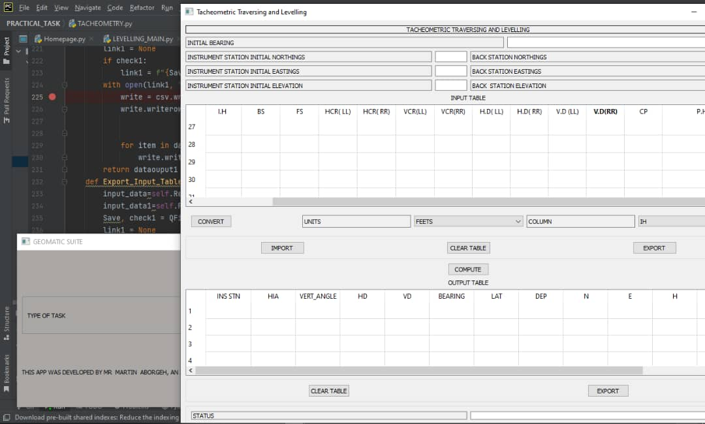

# Computing for X,Y,Z Geospatial Location from Tacheometry Collected Data

## Project Description

This application simplifies the extraction of X, Y, Z data from tacheometry collected data, reducing the need for manual work. It is built using Python and PyQt5.

## Table of Contents

- [Installation](#installation)
- [Dependencies](#dependencies)
- [Usage](#usage)
- [Contribution](#contribution)

## Installation

Follow these steps to set up and run the project:

1. Clone this repository:

      git clone https://github.com/martinaborgeh/Computing-for--X-Y-Z-Geospatial-Location-using-Tacheometry-data.git

2. Download and install Python and an IDE (e.g., PyCharm or VS Code).

3. Open the cloned folder as your project directory.

4. Install the required dependencies:

pip install PyQt5 pandas

## Dependencies

The project relies on the following dependencies:

- PyQt5
- Pandas

## Usage

1. Run the  TACHEOMETRY.py 
2. Import data or enter it manually
3. Click the 'Compute' button
4. Export the results to Excel for further analysis in other geospatial software

<!-- You can add screenshots or GIFs here to demonstrate the usage -->

## Contribution

We welcome contributions to this project! If you'd like to get involved, please follow these steps:

1. Fork the repository.
2. Create a new branch for your feature or bug fix.
3. Make your changes and commit them.
4. Open a pull request to merge your changes into the main branch.

